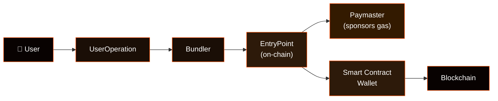
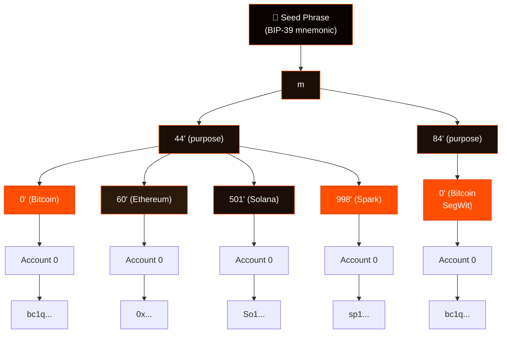
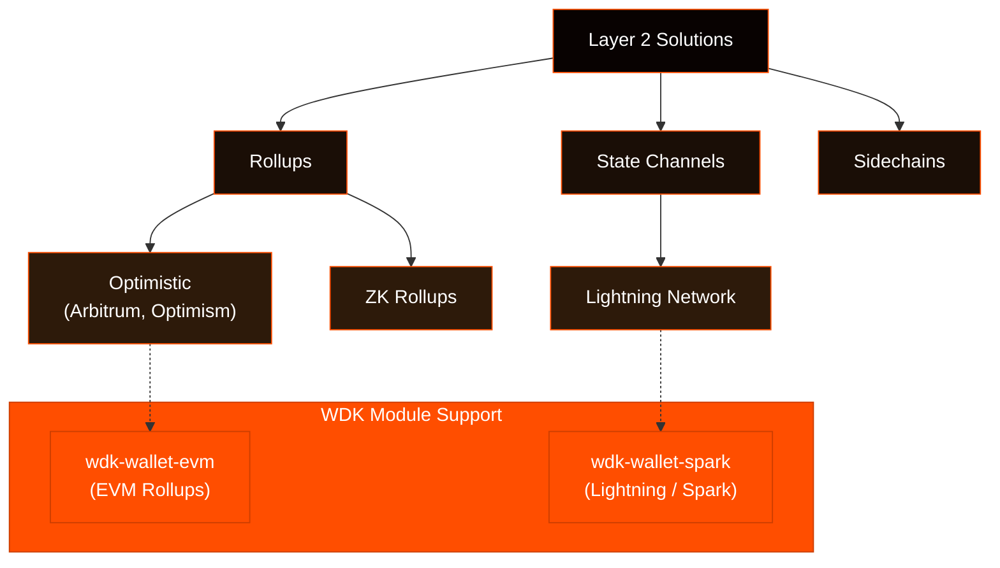
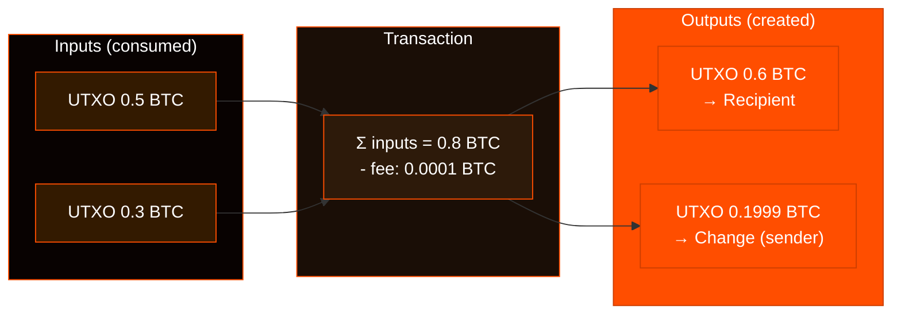
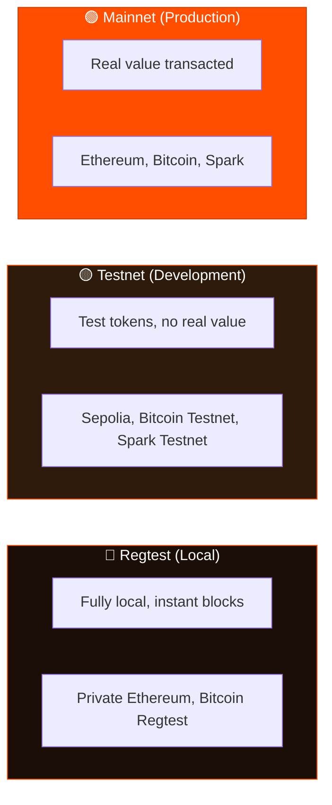

## Account Abstraction

Account Abstraction is a blockchain technology that separates the concept of a user account from the mechanism of transaction validation and fee payment. In traditional blockchain systems, users must pay transaction fees in the native token of the blockchain (like ETH on Ethereum). Account Abstraction allows users to pay fees in other tokens or have fees sponsored by third parties, enabling gasless transactions and enhanced user experiences.

### WDK Implementation

WDK provides Account Abstraction support through specialized wallet modules:

- `@tetherto/wdk-wallet-evm-erc4337` - EVM chains with ERC-4337 standard
- `@tetherto/wdk-wallet-ton-gasless` - TON blockchain with gasless transactions
- `@tetherto/wdk-wallet-tron-gasfree` - TRON blockchain with gas-free transactions

These modules allow developers to implement gasless transaction flows where users can pay fees in tokens like USD₮ or XAU₮ instead of native blockchain tokens.

## ERC-4337

ERC-4337 is an Ethereum standard that enables Account Abstraction without requiring changes to the Ethereum protocol itself. It introduces a new transaction type called "UserOperation" that allows smart contract wallets to handle transaction validation and fee payment logic through components like EntryPoint contracts, Bundlers, and Paymasters.

## Gasless Transactions

Gasless transactions allow users to perform blockchain operations without holding native tokens for gas fees. Instead, transaction fees are paid by third-party services or in alternative tokens, enabling new user onboarding, cross-chain operations, and corporate applications where companies can sponsor employee transactions.

## Paymaster Services

Paymaster services are third-party providers that sponsor transaction fees on behalf of users. They accept payment in various tokens and handle the conversion and payment of gas fees to the blockchain network, providing fee estimation, gas optimization, and high transaction success rates.

## Safe Accounts

Safe Accounts are smart contract wallets built on the Safe protocol that provide enhanced security features and multi-signature capabilities. In the context of ERC-4337, Safe Accounts can be used as the underlying wallet implementation, combining the security benefits of multi-signature with the flexibility of Account Abstraction for enterprise, family, and institutional use cases.

## BIP Standards

BIP (Bitcoin Improvement Proposal) standards define common practices for Bitcoin and other blockchain wallets. WDK modules implement several key BIP standards for consistent wallet behavior across different blockchains.

### BIP-39 (Mnemonic Seed Phrases)

BIP-39 defines a standard for generating mnemonic seed phrases from random entropy. These phrases are human-readable and can be used to recover wallet private keys. WDK modules use BIP-39 for secure seed phrase generation and validation.

### BIP-44 (Multi-Account Hierarchy)

BIP-44 defines a hierarchical deterministic wallet structure that allows creating multiple accounts from a single seed phrase. The derivation path format is `m/purpose'/coin_type'/account'/change/address_index`, where each module uses its specific coin type (e.g., 60 for Ethereum, 998 for Spark).

### BIP-84 (Native SegWit)

BIP-84 defines the derivation path for native SegWit addresses (P2WPKH) in Bitcoin wallets. This standard provides better security and lower transaction fees compared to legacy Bitcoin addresses.

## Lightning Network

The Lightning Network is a second-layer payment protocol built on top of Bitcoin that enables instant, low-fee transactions. It works by creating payment channels between parties, allowing them to transact without broadcasting every transaction to the Bitcoin blockchain.

### Key Features

- **Instant Payments**: Transactions settle immediately within payment channels
- **Low Fees**: Minimal fees compared to on-chain Bitcoin transactions
- **Scalability**: Can handle millions of transactions per second
- **BOLT11 Invoices**: Standard format for Lightning payment requests

### WDK Integration

The Spark wallet module integrates Lightning Network functionality, allowing users to create and pay Lightning invoices directly from their Spark wallets.

## Layer 2 Solutions

Layer 2 solutions are protocols built on top of existing blockchains to improve scalability, reduce fees, and enhance transaction speed. They process transactions off the main blockchain and periodically settle to the base layer.

### Types of Layer 2

- **Rollups**: Bundle multiple transactions and submit them as a single transaction to the main chain
- **State Channels**: Allow parties to transact off-chain and settle periodically
- **Sidechains**: Independent blockchains that connect to the main chain via bridges

### WDK Support

WDK modules support various Layer 2 solutions:
- **Spark**: Bitcoin Layer 2 with Lightning Network integration
- **EVM Rollups**: Support for Arbitrum, Optimism, and other EVM-compatible rollups

## EVM (Ethereum Virtual Machine)

The Ethereum Virtual Machine is a runtime environment that executes smart contracts on Ethereum and other EVM-compatible blockchains. It provides a standardized way to run decentralized applications across different networks.

### EVM-Compatible Chains

Many blockchains are EVM-compatible, meaning they can run the same smart contracts and use the same tools as Ethereum:
- **Polygon**: Layer 2 scaling solution for Ethereum
- **BSC**: Binance Smart Chain
- **Arbitrum**: Optimistic rollup for Ethereum
- **Optimism**: Layer 2 scaling solution

### WDK EVM Support

The `@tetherto/wdk-wallet-evm` module works with any EVM-compatible blockchain, providing unified access to multiple networks through a single API.

## UTXO (Unspent Transaction Output)

UTXO is a fundamental concept in Bitcoin and other UTXO-based blockchains. Each transaction consumes previous UTXOs and creates new ones, forming a chain of ownership.

### How UTXOs Work

1. **Inputs**: References to previous UTXOs that are being spent
2. **Outputs**: New UTXOs created by the transaction
3. **Change**: Remaining value returned to the sender as a new UTXO

### WDK UTXO Management

The Bitcoin wallet module automatically handles UTXO selection and change address management, ensuring optimal transaction construction and fee calculation.

## Seed Phrases and Private Keys

Seed phrases and private keys are the foundation of wallet security in blockchain systems.

### Seed Phrases (BIP-39)

- **12-24 words**: Human-readable representation of wallet entropy
- **Deterministic**: Same seed phrase always generates the same keys
- **Recovery**: Can recover entire wallet from seed phrase
- **Security**: Must be kept secure and never shared

### Private Keys

- **256-bit numbers**: Cryptographic keys that control wallet funds
- **Derived from seed**: Generated deterministically from seed phrase
- **Signing**: Used to sign transactions and prove ownership
- **Memory safety**: WDK modules handle private keys securely with automatic cleanup

## Network Types

Blockchain networks come in different types for different use cases.

### Mainnet

Production networks where real value is transacted:
- **Ethereum Mainnet**: Production Ethereum network
- **Bitcoin Mainnet**: Production Bitcoin network
- **Spark Mainnet**: Production Spark network

### Testnet

Development networks for testing without real value:
- **Goerli/Sepolia**: Ethereum test networks
- **Bitcoin Testnet**: Bitcoin test network
- **Spark Testnet**: Spark test network

### Regtest

Local networks for development and testing:
- **Local Ethereum**: Private Ethereum network
- **Bitcoin Regtest**: Local Bitcoin network
- **Spark Regtest**: Local Spark network

### Testnet Funds & Faucets

To test transactions without spending real assets, developers use "Testnets"—networks that mimic the main blockchain but use tokens with no monetary value. You can obtain these tokens for free from different publicly available "Faucets". Links to common "Faucets" are below.


The below faucets are for testnets. The USD₮ tokens and other tokens available at the links below are not real and do not entitle the holder to anything. In particular, they cannot be redeemed with Tether International, S.A. de C.V. ("Tether International") and are not Tether Tokens as described in [Tether International's Terms of Service](https://tether.to/en/legal). The USD₮ tokens available at the links below on various testnets are intended for testing WDK on the applicable testnet. The links below are links to third-party websites and are Third-Party Information as described in Tether Operations, S.A. de [C.V.'s Website Terms](https://tether.io/terms/).


#### Common Faucets
*   **USD₮ Test Tokens (Sepolia)**: [Pimlico Faucet](https://dashboard.pimlico.io/test-erc20-faucet)
*   **USD₮ Test Tokens (Sepolia)**: [Candide Faucet](https://dashboard.candide.dev/faucet)
*   **Ethereum (Sepolia)**: [Google Cloud Web3 Faucet](https://cloud.google.com/application/web3/faucet/ethereum/sepolia)
*   **Aave Test Tokens (Sepolia)**: [Aave Faucet](https://app.aave.com/faucet/) — get test USD₮, DAI and other tokens for DeFi testing
*   **TON Testnet**: [Testgiver Bot](https://t.me/testgiver_ton_bot)
*   **Bitcoin Testnet**: [CoinFaucet](https://coinfaucet.eu/en/btc-testnet/)
