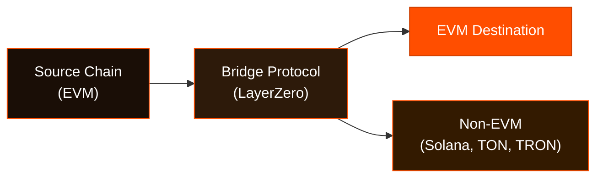

# Bridge Modules Overview

The Wallet Development Kit (WDK) provides a set of modules that support bridging between different blockchain networks. All modules share a common interface, ensuring consistent behavior across different blockchain implementations.

## Bridge Protocol Modules

Cross-chain bridge functionality for token transfers between blockchains:

| Module | Route | Status | Documentation |
|--------|-------|--------|---------------|
| [`@tetherto/wdk-protocol-bridge-usdt0-evm`](https://github.com/tetherto/wdk-protocol-bridge-usdt0-evm) | EVM → EVM + Non-EVM | ✅ Ready | [Documentation](./bridge-usdt0-evm/) |

## Next steps

To get started with WDK modules, follow these steps:

1. Get up and running quickly with our [Quick Start Guide](../../start-building/nodejs-bare-quickstart.md)
2. Choose the modules that best fit your needs from the tables above 
3. Check specific documentation for modules you wish to use

You can also:

- Learn about key concepts like [Account Abstraction](../../resources/concepts.md#account-abstraction) and other important definitions
- Use one of our ready-to-use examples to be production ready
