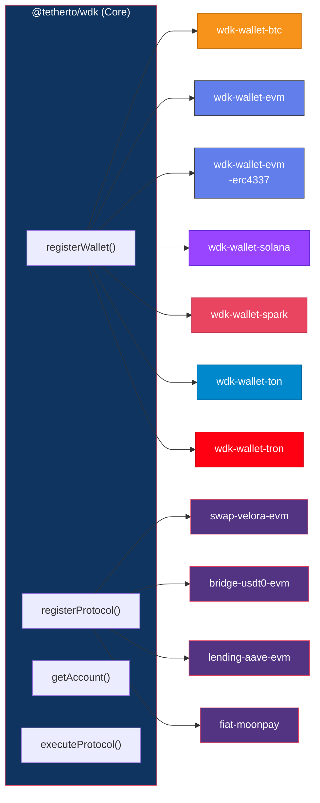

# @tetherto/wdk-core

 This package serves as the main entry point and **orchestrator for all WDK wallet and protocol modules**, allowing you to register and manage different blockchain wallets through a single, unified interface.

## Next Steps

<table data-card-size="large" data-view="cards">
	<thead>
		<tr>
			<th></th>
			<th></th>
			<th></th>
			<th data-hidden data-card-target data-type="content-ref"></th>
		</tr>
	</thead>
	<tbody>
		<tr>
			<td>
				<i class="fa-code">:code:</i>
			</td>
			<td>
				<strong>Node.js Quickstart</strong>
			</td>
			<td>Get started with WDK in a Node.js environment</td>
			<td>
				<a href="../../start-building/nodejs-bare-quickstart.md">nodejs-quickstart.md</a>
			</td>
		</tr>
        <tr>
			<td>
				<i class="fa-code">:code:</i>
			</td>
			<td>
				<strong>WDK Core Configuration</strong>
			</td>
			<td>Get started with WDK's configuration</td>
			<td>
				<a href="./configuration.md">WDK Core Configuration</a>
			</td>
		</tr>
        <tr>
			<td>
				<i class="fa-code">:code:</i>
			</td>
			<td>
				<strong>WDK Core API</strong>
			</td>
			<td>Get started with WDK's API</td>
			<td>
				<a href="./api-reference.md">WDK Core API</a>
			</td>
		</tr>
        <tr>
			<td>
				<i class="fa-code">:code:</i>
			</td>
			<td>
				<strong>WDK Core Usage</strong>
			</td>
			<td>Get started with WDK's usage</td>
			<td>
				<a href="./usage.md">WDK Core Usage</a>
			</td>
		</tr>
	</tbody>
</table>

***

### Need Help?


