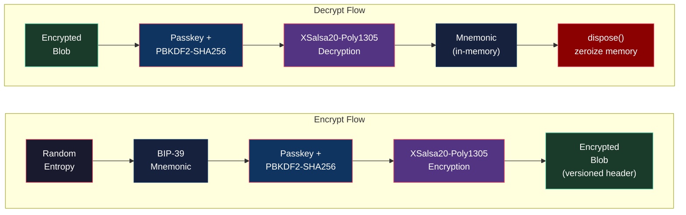

# Secret Manager

The Secret Manager is a secure, in‑memory system for generating, encrypting, decrypting, and managing wallet seed phrases (mnemonics) and sessions. It is designed for wallet applications where user secrets must be protected and never stored in plaintext. Generates, encrypts, decrypts, and converts BIP39 mnemonics using strong, modern cryptography.

Powered by [`@tetherto/wdk-secret-manager`](https://github.com/tetherto/wdk-secret-manager).

## Features

- **Seed & Entropy Protection**: Generate and encrypt BIP39 seed (64‑byte) and entropy (16‑byte)
- **Strong Key Derivation**: PBKDF2‑SHA256 with configurable iterations (default 100,000)
- **Authenticated Encryption**: libsodium secretbox (XSalsa20‑Poly1305) with versioned, self‑describing headers
- **Mnemonic Utilities**: 16‑byte entropy ↔ 12‑word BIP39 mnemonic helpers
- **Secure Randoms**: Cryptographically secure salt and entropy generators
- **Master‑Key Mode**: Optional 32‑byte key to skip PBKDF2 when you already have a derived key
- **Memory Safety**: In‑memory operation, explicit zeroization, and `dispose()` to wipe secrets
- **Cross‑Runtime**: Works in Node and Bare environments

## Why this matters

- Seed phrases grant full control over funds and must never be exposed
- Best practice: never persist plaintext; always encrypt with a user passkey
- Memory‑only handling and prompt zeroization reduce attack surface

<table data-card-size="large" data-view="cards">
	<thead>
		<tr>
			<th></th>
			<th></th>
			<th></th>
			<th data-hidden data-card-target data-type="content-ref"></th>
		</tr>
	</thead>
	<tbody>
		<tr>
			<td>
				<i class="fa-code">:code:</i>
			</td>
			<td>
				<strong>Secret Manager Configuration</strong>
			</td>
			<td>Get started with WDK Secret Manager</td>
			<td>
				<a href="./configuration.md">configuration.md</a>
			</td>
		</tr>
		<tr>
			<td>
				<i class="fa-mobile-alt">:mobile-alt:</i>
			</td>
			<td>
				<strong>Secret Manager API Reference</strong>
			</td>
			<td>Check the API Reference and examples</td>
			<td>
				<a href="./api-reference.md">api-reference.md</a>
			</td>
		</tr>
	</tbody>
</table>

***

## Need Help?



